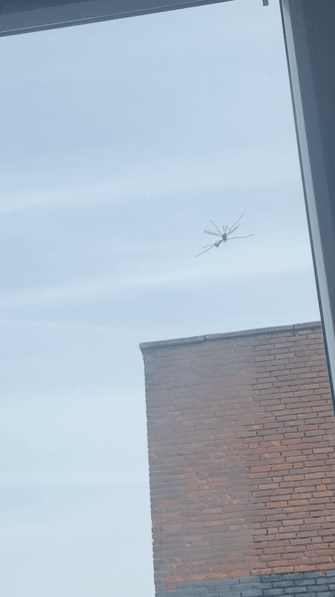

# Mosquito
This is a **JOKE**. Regardless I still suggest looking at the code and trying it :).

# Requirements
Have the JDK installed.

# Usage
1. Run the program in your IDE or from the command line.
2. The methods and classes are quite self explanatory. 
3. Look at the code.
4. For the most favorable experience use command line.
5. Open a terminal at the location of the folder src.
6. Type: javac GiantMosquito.java
7. Type: java GiantMosquito
8. Let the mosquito annoy you.
9. When enough annoyance is caused, you can get rid of it with ctrl-c.
10. Get the stats! (mosquito's lifespan)

## The inspiration:

## Future plans
None, really
